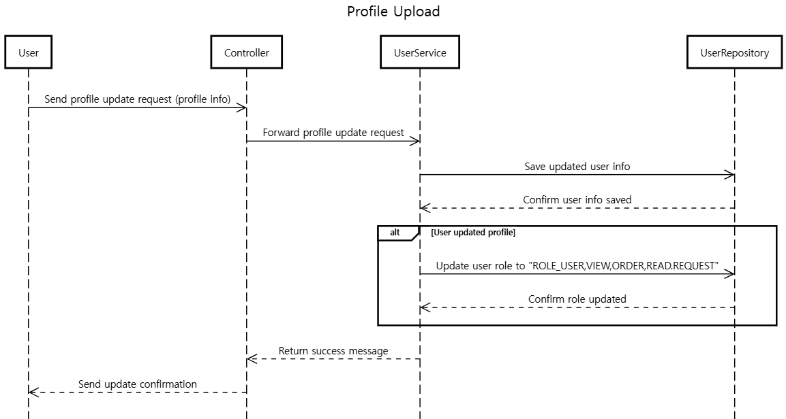

# **SHOPPING MALL - 쇼핑몰**

### 저자 : 응우옌티홍 - 2668

## A. 설정 구성

## B. 실행

1. 본 Repository를 clone 받는다.
2. Intellij IDEA (Java 17 버전 필요)를 이용해 clone 받은 폴더를 연다.
3. [ShoppingApplication.java](src\main\java\com\example\shopping\ShoppingApplication.java)의 `main`을 실행한다.

## C. Database Diagram

## D. Authentication Diagram

## D. 필수 기능

### 1. 사용자 인증 및 권한 처리

#### 1.1 인증 체계 : /login

#### 1.2 회원가입 : /register

##### 사용자의 프로필 업로드 & 업데이트: "/users/updateProfile"

##### 사용자의 프로필 이미지가 업로드 &업데이트: "/users/updateImage"

#### 1.3 사용자의 권한이 관리

##### 일반 사용자는 사업자 사용자로 전환신청 : "/openRequest"

##### 관리자는 사업자 사용자 전환 신청 목록을 확인이나 수락 또는 거절 : "/admin/openRequest/confirm/{requestId}"

#### Admin (UserService에서 Admin를 만든다)

관리자는 서비스와 상관없이 고정된 사용자 - 다른 회원가입 과정을 통해 만들어진 사용자는 관리자가 될 수 없다

#### 사용자와 관리자는 신청을 보기 : "/read/openRequest/{requestId}"

#### 관리자는 전제 신청을 보기 : "/admin/openRequest/readAll"

### 2.쇼핑몰 운영하기

#### 2.1 쇼핑몰 개설

##### 2.1.1 쇼핑몰에는 이름, 소개, 분류의 정보를 수정 : "/shop/update"

##### 2.1.2 분류의 종류는 서비스 제작자에 의해 미리 정해진다 : "/itemCategory"

##### 2.1.3 쇼핑몰 주인은 사유를 작성하여 쇼핑몰 폐쇄 요청 : "/shop/closeRequest"

##### 2.1.4 관리자는 쇼핑몰 폐쇄 요청을 수락 :"/admin/closeRequest/confirm/{closeId}"

#### 2.2 쇼핑몰 관리 :

##### 2.2.1 쇼핑몰 주인은 쇼핑몰에 상품을 등록 :"/shop/product"

(필수적인 정보는 상품 이름, 상품 이미지, 상품 설명, 상품 가격, 상품 재고)

##### 2.2.2 쇼핑몰 주인은 등록한 상품을 수정 : "/shop/{productId}"

##### 2.2.3 쇼핑몰 주인은 등록한 상품을 삭제 : "/shop/{productId}"

#### 2.3 쇼핑몰 조회 :"/view/shops"

- 비활성 사용자를 제외한 사용자는 쇼핑몰을 조회할 수 있다.
  - 조건 없이 조회할 경우, 가장 최근에 거래가 있었던 쇼핑몰 순서로 조회된다.
  - 이름, 쇼핑몰 분류를 조건으로 쇼핑몰을 검색할 수 있다.

#### 2.4 - 쇼핑몰 상품 검색 :"/view/products"

#### 2.5 쇼핑몰 상품 구매

비활성 사용자를 제외한 사용자는 쇼핑몰의 상품을 구매할 수 있다.

##### 2.5.1 상품과 구매 수량을 기준으로 구매 요청 :"/orders/{productId}"

##### 2.5.2 주인이 전달된 구매 요청을 수락 : "/shop/accept/{orderId}"

- 상품 재고가 자동으로 갱신된다. 이후엔 구매 취소가 불가능하다.

##### 2.5.3 구매 요청이 수락되기 전에는 구매 요청을 취소 : "/orders/cancel/{orderId}"

##### 2.5.4 상용자 전제 구매 항목을 보기 :"/orders/userView"

##### 2.5.5 주인 전제 주문 항목을 보기 :"/shop/orderView"
